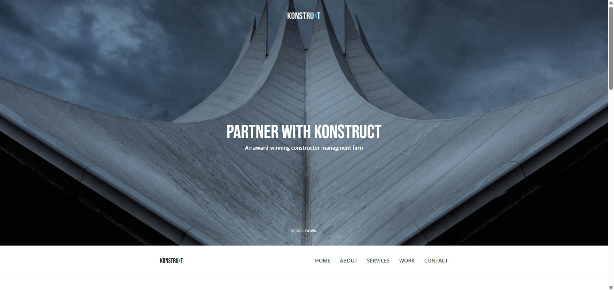

# 🌐 Site Construct - website markup



<p align="center">
  <a href="https://github.com/elfototo/site_konstruct" target="_blank">
    
  </a>
  <a href="(https://elfototo.github.io/construction_company_website/)" target="_blank">
    
  </a>
</p>

> **This repository contains the HTML and CSS markup for a basic website layout. A perfect starting point for building responsive sites.**

---

## 📚 Table of Contents
- [🌐 Site Construct - Вёрстка сайта](#-site-construct---вёрстка-сайта)
  - [📚 Table of Contents](#-table-of-contents)
  - [🎯 Project Overview](#-project-overview)
  - [⚙️ Technologies Used](#️-technologies-used)
  - [🌐 Live Demo](#-live-demo)
  - [🚀 How to Use Locally](#-how-to-use-locally)

---

## 🎯 Project Overview

This repository provides a simple layout of a **responsive website** built with **HTML** and **CSS**. The site features basic elements such as:

- **Header** with navigation
- **Main content area** with text and images
- **Footer** with contact info and social media links
- **Responsive design** for mobile and desktop viewports

Perfect as a template for personal projects or as a starting point for more complex web development.

---

---

## ⚙️ Technologies Used

This project is built using:


---

## 🌐 Live Demo

You can view the website live here:  
👉 [Live Demo]((https://elfototo.github.io/construction_company_website/))

---

## 🚀 How to Use Locally

1. **Clone the repository:**

    ```bash
    git clone https://github.com/elfototo/site_konstruct.git
    cd site_konstruct
    ```

2. **Run the project locally using Go Live (VS Code extension):**

    - If you're using **VS Code**, you can use the **Go Live** extension to start the project.
    - Simply open the project folder in **VS Code**, then click the **Go Live** button in the bottom-right corner. This will launch the application in your browser.
Alternatively, if you prefer not to use **VS Code**, you can serve the project locally using any static server, such as **http-server**.

    To install **http-server** (if you don't have it), you can run:

    ```bash
    npm install -g http-server
    ```
    
